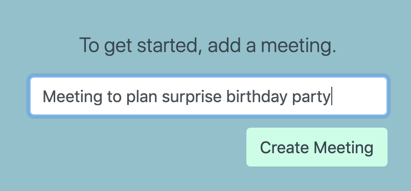
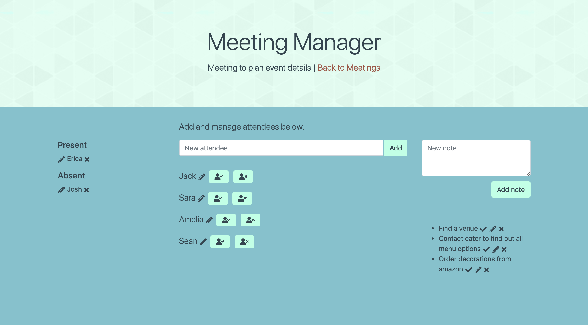
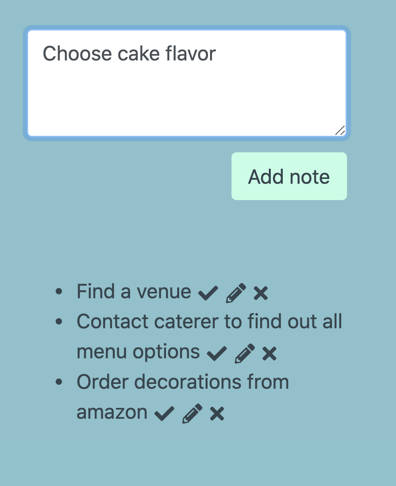

# Meeting Manager

### Overview
This is a Node.js app designed to help manage meetings for clubs, small organizations, or personal needs. The app allows for the following functionalities:
* Adding new meetings
* Adding, editing, and deleting attendees
* Adding notes associated with that specific meeting

### Tools used
Node, Express, MySQL, Sequelize, Handlebars, Bootstrap, custom CSS, jQuery, Subtle Patterns and Font Awesome for additional styling

### Getting started
Navigate to the app's [homepage](https://meeting-manager-app.herokuapp.com/).

Add a meeting - this description can be anything you like and will be used to identify the meeting.

Once added, the meeting will be listed under previous meetings.

Clicking on the meeting will navigate to that meeting's page. If it's new, all sections will be blank.

Add attendees to the meeting. This automatically adds them to a list with a status of "awaiting attendee."

Clicking the icons marks the attendee as present or absent.

Clicking the pencil displays options to update attendees. If nothing is entered for the name input, no changes will be made to the person's name. The other two inputs are required.

Add notes/to-do items associated with the current meeting.  
✔️ - Simply crosses out the to do as completed. Clicking again removes this in case the items still needs to be done.  
✏️ - Enables editing of note content.  
✖️ - Deletes notes upon user confirmation.  

### Future updates
The following will be added to expand the app's functionality:
* Ability to edit and delete meetings